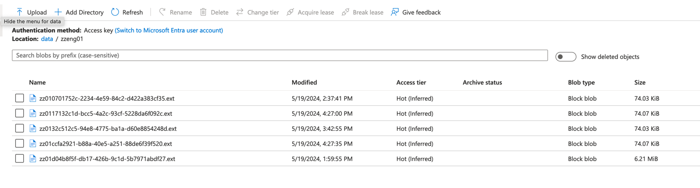

# Title
How to ingest data from Oracle into Azure ADLS Gen2

# Purpose
Run SELECT to ingest data from Oracle 19c, and save the data into Azure ADLS Gen2 object storage, in Parquet format.

# Steps
## Step 1 Prepare environment
Make sure the Oracle 19c environment works well.


Prepare a table:
```sql
CREATE TABLE demo_sample (
                          column1 NUMBER,
                          column2 NUMBER,
                          column3 NUMBER,
                          column4 VARCHAR2(10),
                          column5 VARCHAR2(10),
                          column6 VARCHAR2(10),
                          column7 VARCHAR2(10),
                          column8 VARCHAR2(10),
                          column9 VARCHAR2(10),
                          column10 VARCHAR2(10),
                          column11 VARCHAR2(10),
                          column12 VARCHAR2(10),
                          CONSTRAINT pk_demo_sample PRIMARY KEY (column1, column2, column3, column4, column5, column6, column7, column8, column9)
);
```

Prepare 20000 records data:
```python
import cx_Oracle
import random

# Oracleデータベース接続情報
dsn = cx_Oracle.makedsn("<your Oracle database>", 1521, service_name="PDB1")
connection = cx_Oracle.connect(user="<your user name>", password="<your password>", dsn=dsn)

# データ挿入関数
def insert_data():
    cursor = connection.cursor()

    sql = """
    INSERT INTO demo_sample (
        column1, column2, column3, column4, column5, column6,
        column7, column8, column9, column10, column11, column12
    ) VALUES (
        :1, :2, :3, :4, :5, :6, :7, :8, :9, :10, :11, :12
    )
    """

    batch_size = 10000
    data = []

    for i in range(20000):  # 2万件
        record = (
            random.randint(1, 1000),
            random.randint(1, 1000),
            random.randint(1, 1000),
            ''.join(random.choices('ABCDEFGHIJKLMNOPQRSTUVWXYZ', k=10)),
            ''.join(random.choices('ABCDEFGHIJKLMNOPQRSTUVWXYZ', k=10)),
            ''.join(random.choices('ABCDEFGHIJKLMNOPQRSTUVWXYZ', k=10)),
            ''.join(random.choices('ABCDEFGHIJKLMNOPQRSTUVWXYZ', k=10)),
            ''.join(random.choices('ABCDEFGHIJKLMNOPQRSTUVWXYZ', k=10)),
            ''.join(random.choices('ABCDEFGHIJKLMNOPQRSTUVWXYZ', k=10)),
            ''.join(random.choices('ABCDEFGHIJKLMNOPQRSTUVWXYZ', k=10)),
            ''.join(random.choices('ABCDEFGHIJKLMNOPQRSTUVWXYZ', k=10)),
            ''.join(random.choices('ABCDEFGHIJKLMNOPQRSTUVWXYZ', k=10))
        )
        data.append(record)

        if len(data) == batch_size:
            cursor.executemany(sql, data)
            connection.commit()
            data = []

    if data:
        cursor.executemany(sql, data)
        connection.commit()

    cursor.close()

# メイン処理
try:
    insert_data()
finally:
    connection.close()
```

## Step 2 Processor: ExecuteSQLRecord


This `ExecuteSQLRecord` uses two Service,
1) Database Connection Pooling Service : `DBCPConnectionPool` Processor, named EC2-DBCPConnectionPool
2) `ParquetRecordSetWriter`, named ParquetRecordSetWriter.

## Step 3 : Create DBCPConnectionPool
Download the Oracle JDBC Driver from here
https://www.oracle.com/jp/database/technologies/appdev/jdbc-downloads.html


Save the jdbc driver here (or anywhere your nifi can access):
> /Users/zzeng/Downloads/tools/Oracle_JDBC/ojdbc8-full/ojdbc8.jar

DBCPConnectionPool Properties: 


* Database Connection URL: The JDBC Driver URI. eg. `jdbc:oracle:thin:@//ec2-54-222-333-444.compute-1.amazonaws.com:1521/PDB1`
* Database Driver Class Name : `oracle.jdbc.driver.OracleDriver`
* Database Driver Location(s) : `/Users/zzeng/Downloads/tools/Oracle_JDBC/ojdbc8-full/ojdbc8.jar`
* Database User : my Oracle access user name, eg `zzeng`
* Password : Password, it will be automatically encrypted by NiFi

## Step 4: Create ParquetRecordSetWriter service
We can use default settings here.


## Step 5 : UpdateAttribute to set the file name in Azure
Add a value :


Key : `azure.filename`
Value : `${uuid:append('.ext')}`


## Step 6 : Use `PutAzureDataLakeStorage` to save data into Azure


## Step 7: Create `ADLSCredentialsControllerService` service for `PutAzureDataLakeStorage` so that we can save data into Azure


* Storage Account Name : the value in your Azure account 

* 
* SAS Token : The value in your Azure account

* 


## Step 8: Enable the 3 services


## Step 9: Have a try
`Run Once`


And you will find the files are there

